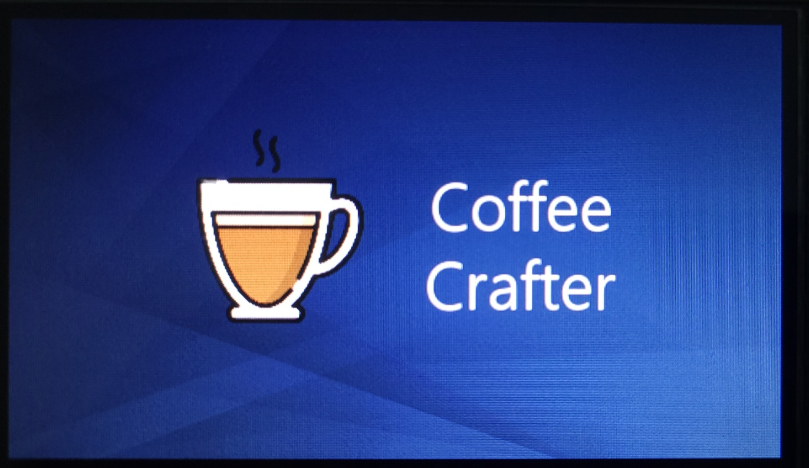
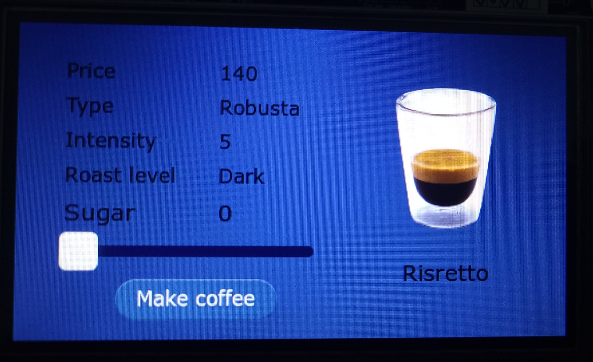
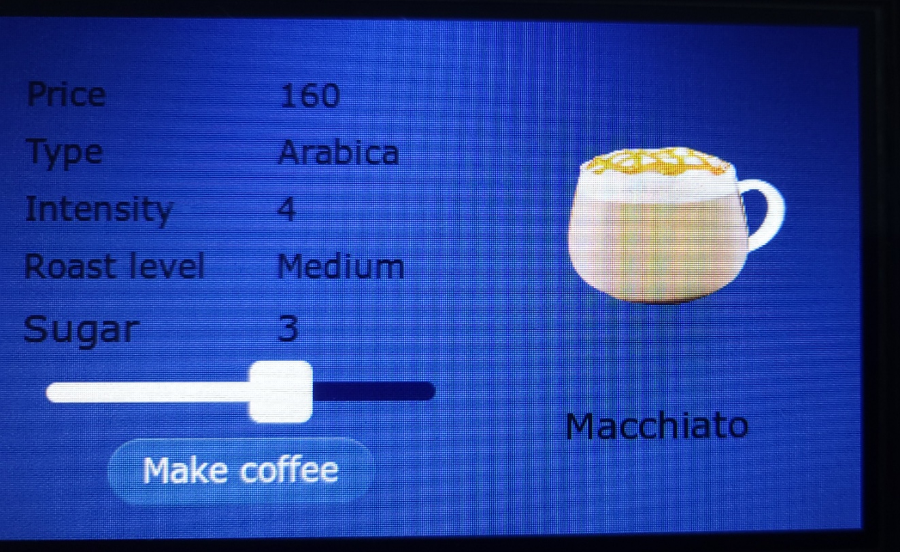
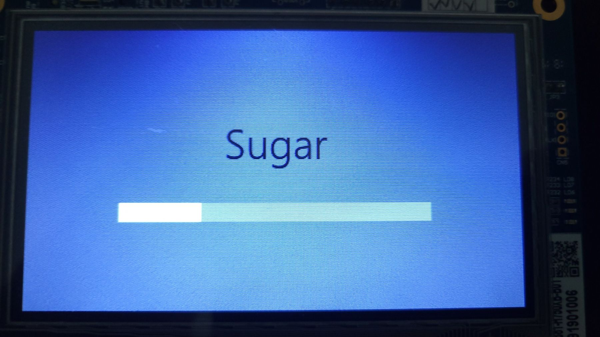
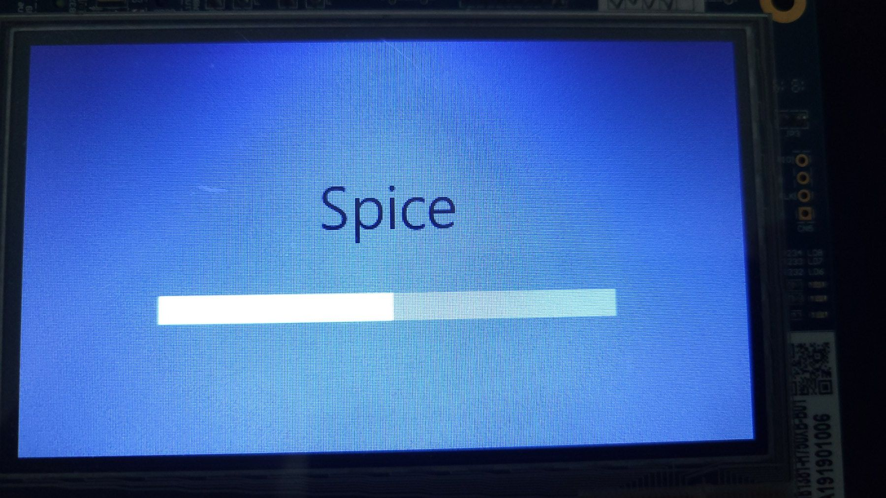
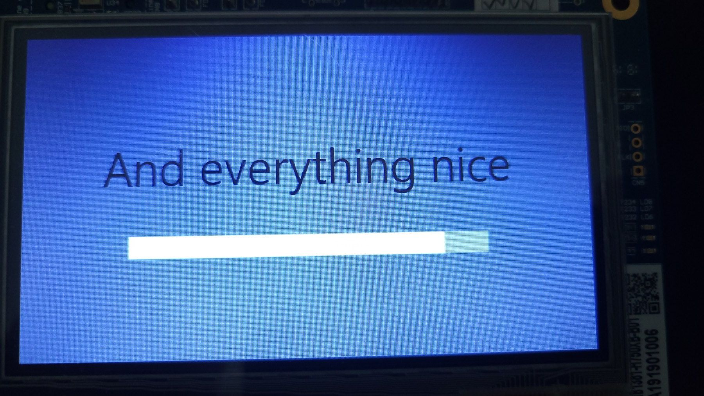
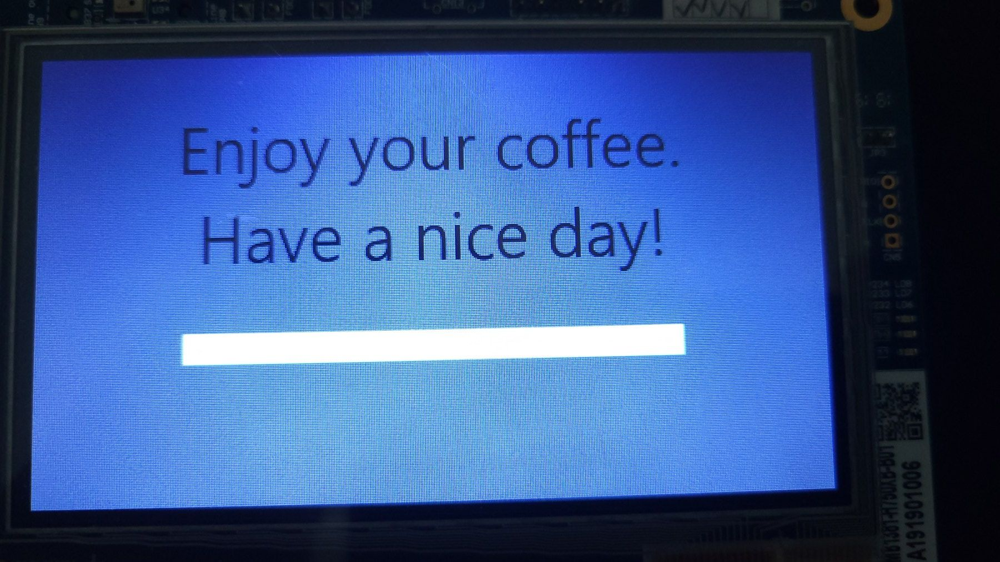

#  CoffeeCrafter
### Coffee Vending Machine

<!--[CoffeeCrafter Logo](images/logo150.png)-->

Improve your coffee brewing experience with our user-friendly interface powered by STM32H750B-DK microcontroller and TouchGFX GUI framework.

## Screenshots

### Welcome Screen

### Main Menu Screen

### Preparing Screen

## Features

- **Welcome Screen**: Starting and idle screen.
- **Main Menu Screen**: Choose your coffee.
- **Preparing Screen**: Coffee preparation.

## Tools Used

- **STM32CubeIDE**: Version 1.14.1
- **TouchGFX**: Version 4.23.1

#### Note
Running the simulator will throw an unknown "FreeRTOS.h" and "queue.h" file error.
